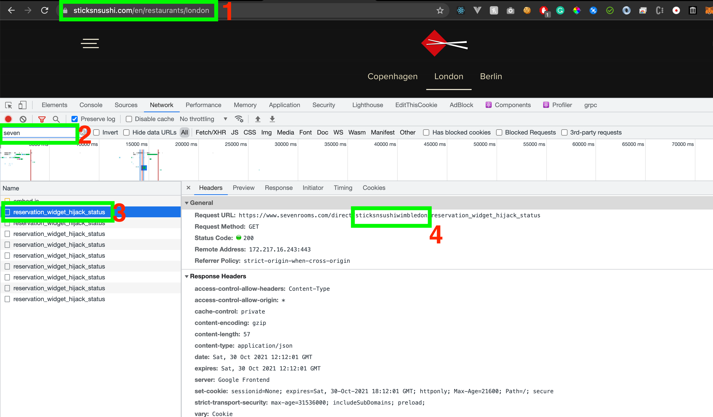

# Seven Rooms Time Availbility Checker

This is a simple program to allow you to fetch and get notified when a booking is available for a room/table at your favourite hotel which is being servced by the sevenrooms api.

Getting this up and running is super simple

##  Configuration Steps

- Install dependencies `pip install -r requirements.txt`
- Change and rename the `config.example.py` to `config.py` with your own details.
- Run `python3 main.py`

And you never have to worry about getting a reservation at your favourite hotel again.

##  How to get restaurant ID for your hotel

- Navigate to your hotel which uses seven rooms api for booking. In this instance, i'm using [Sticks n Sushi](https://sticksnsushi.com/restuarants/london) as an example. (STEP 1 in image)
- Navigate through pages with inspect element open (ctrl + shift + i)
- Keep the network tab open with `Preserve log` option selected.
- Filter for seven in the filter search tab. (STEP 2 in image)
- Click through the results and find one which has the resturant id in the url (STEP 3 in the image).
- Copy the restuarant id from the url and paste it into the `config.py` file under the `VENUE` variable.

##  Contributions

Feel like you want to add more functionality or improve the existing code base? Knock yourself out! Any contributions are welcome.
